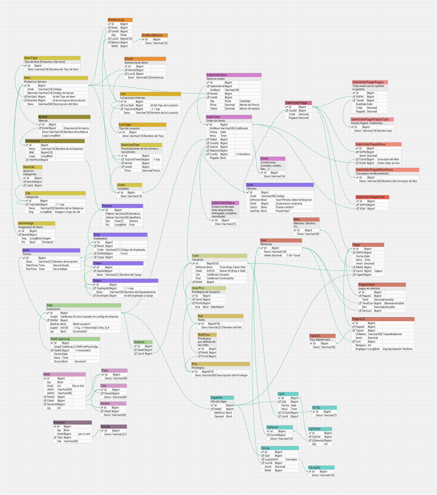

# POS System

This repository is dedicated to showcasing the design and functionality of a comprehensive Point-of-Sale (POS) system. Initially, it contains the database schema, with plans to add the full source code and screenshots of the application in the near future.

## Key Features

- **Multi-Currency Support:** Seamlessly handles transactions in multiple currencies.
- **User and Station-Based Privileges:** Configurable access control for different users and terminals.
- **AES-Encrypted Login:** Ensures secure authentication.
- **Product Management:** Single product with multiple price configurations sharing the same inventory, e.g., tracking quantities per unit or package while maintaining a unified stock count.
- **Highly Parametrized Accounts Receivable:** Supports sales on credit and promissory notes with detailed reporting.
- **Detailed Dashboards:** Provides insights into daily, weekly, and monthly sales, along with accounts receivable.

## Current Contents

- **Database Schema:** A normalized and robust schema, designed to support all system functionalities.

## Future Additions

1. Full source code of the POS system.
2. Screenshots of the user interface.
3. Technical documentation for installation and deployment.

## Database Schema

The following is the initial design of the database schema, which is normalized and optimized for scalability.

By AFAlzMat.
